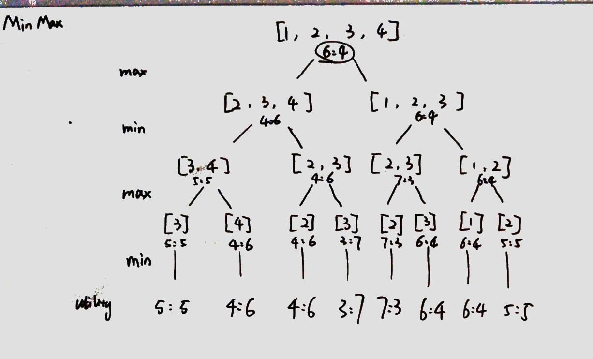

### [486\. Predict the Winner](https://leetcode.com/problems/predict-the-winner/)

Difficulty: **Medium**


Given an array of scores that are non-negative integers. Player 1 picks one of the numbers from either end of the array followed by the player 2 and then player 1 and so on. Each time a player picks a number, that number will not be available for the next player. This continues until all the scores have been chosen. The player with the maximum score wins.

Given an array of scores, predict whether player 1 is the winner. You can assume each player plays to maximize his score.

**Example 1:**  

```
Input: [1, 5, 2]
Output: False
Explanation: Initially, player 1 can choose between 1 and 2\. If he chooses 2 (or 1), then player 2 can choose from 1 (or 2) and 5\. If player 2 chooses 5, then player 1 will be left with 1 (or 2). So, final score of player 1 is 1 + 2 = 3, and player 2 is 5\. Hence, player 1 will never be the winner and you need to return False.
```

**Example 2:**  

```
Input: [1, 5, 233, 7]
Output: True
Explanation: Player 1 first chooses 1\. Then player 2 have to choose between 5 and 7\. No matter which number player 2 choose, player 1 can choose 233.Finally, player 1 has more score (234) than player 2 (12), so you need to return True representing player1 can win.
```

**Note:**  

1.  1 <= length of the array <= 20\.
2.  Any scores in the given array are non-negative integers and will not exceed 10,000,000.
3.  If the scores of both players are equal, then player 1 is still the winner.


#### Solution

MinMax 问题，在两个玩家交替进行游戏的时候，每个玩家的每一步都要希望对自己是最有利的。Max是我方行动，我希望maximize我的结果，Min代表对方行动，他希望minimize我的结果（等同于maximize他的结果）。



对于这道题，我们可以想为，每一次选择我都希望我的选择使得我与对手的分差最大！


Language: **Swift**

```swift
class Solution {
    func PredictTheWinner(_ nums: [Int]) -> Bool {
        var store = [Int : Int]()
        return getScore(nums, 0, nums.count - 1, &store) >= 0
    }
    
    private func getScore(_ nums: [Int], _ l: Int, _ r: Int, _ store: inout [Int : Int]) -> Int {
        if l == r { return nums[l] }
        let key = l * nums.count + r
        if store[key] != nil { return store[key]! }
        store[key] = max(nums[l] - getScore(nums, l + 1, r, &store), nums[r] - getScore(nums, l, r - 1, &store))
        // return the max diff score I could get compare to op's selection
        return store[key]!
    }
}
​
```