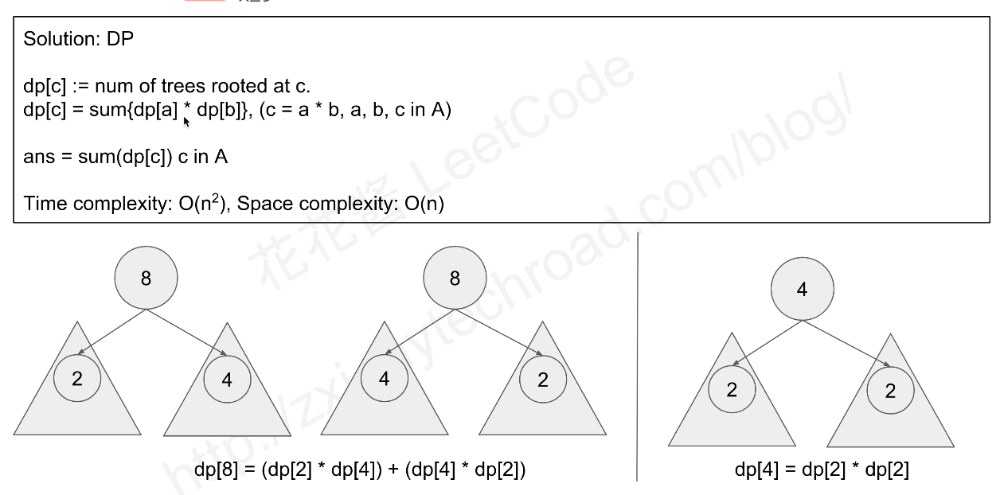

### [823\. Binary Trees With Factors](https://leetcode.com/problems/binary-trees-with-factors/)

Difficulty: **Medium**


Given an array of unique integers, each integer is strictly greater than 1.

We make a binary tree using these integers and each number may be used for any number of times.

Each non-leaf node's value should be equal to the product of the values of it's children.

How many binary trees can we make?  Return the answer **modulo 10 ** 9 + 7**.

**Example 1:**

```
Input: A = [2, 4]
Output: 3
Explanation: We can make these trees: [2], [4], [4, 2, 2]
```

**Example 2:**

```
Input: A = [2, 4, 5, 10]
Output: 7
Explanation: We can make these trees: [2], [4], [5], [10], [4, 2, 2], [10, 2, 5], [10, 5, 2].
```

**Note:**

1.  `1 <= A.length <= 1000`.
2.  `2 <= A[i] <= 10 ^ 9`.


#### Solution

Actually, let dp[i] be the number of ways to have a root node with value A[i].

Since in the above example we always have x < v and y < v, we can calculate the values of dp[i] in increasing order using dynamic programming.

For some root value A[i], let's try to find candidates for the children with values A[j] and A[i] / A[j] (so that evidently A[j] * (A[i] / A[j]) = A[i]). To do this quickly, we will need index which looks up this value: if A[k] = A[i] / A[j], then index[A[i] / A[j]] = k`.

After, we'll add all possible dp[j] * dp[k] (with j < i, k < i) to our answer dp[i]. In our Java implementation, we carefully used long so avoid overflow issues.



Language: **Swift**

```swift
class Solution {
    func numFactoredBinaryTrees(_ A: [Int]) -> Int {
        let kMod = 1000000007
        let A = A.sorted()
        var dp = [Int : Int]()  // key is the value in array, val is the number of tree for this value
        
        for i in 0..<A.count {
            // init the dp, since a single value in A could form a tree of itself
            dp[A[i]] = 1
            // check all smaller values in A, whether could create a tree
            for j in 0..<i {
                // 如果可以整除A[i] % A[j] == 0且，A[i] / A[j] 已经存在于DP中
                if A[i] % A[j] == 0 && dp[A[i] / A[j]] != nil {
                    dp[A[i]] = dp[A[i]]! + (dp[A[j]]! * dp[A[i] / A[j]]!) % kMod
                }
            }
        }
        
        var ans = 0
        for key in dp.keys {
            ans += dp[key]!
        }
        return ans % kMod
    }
}
```