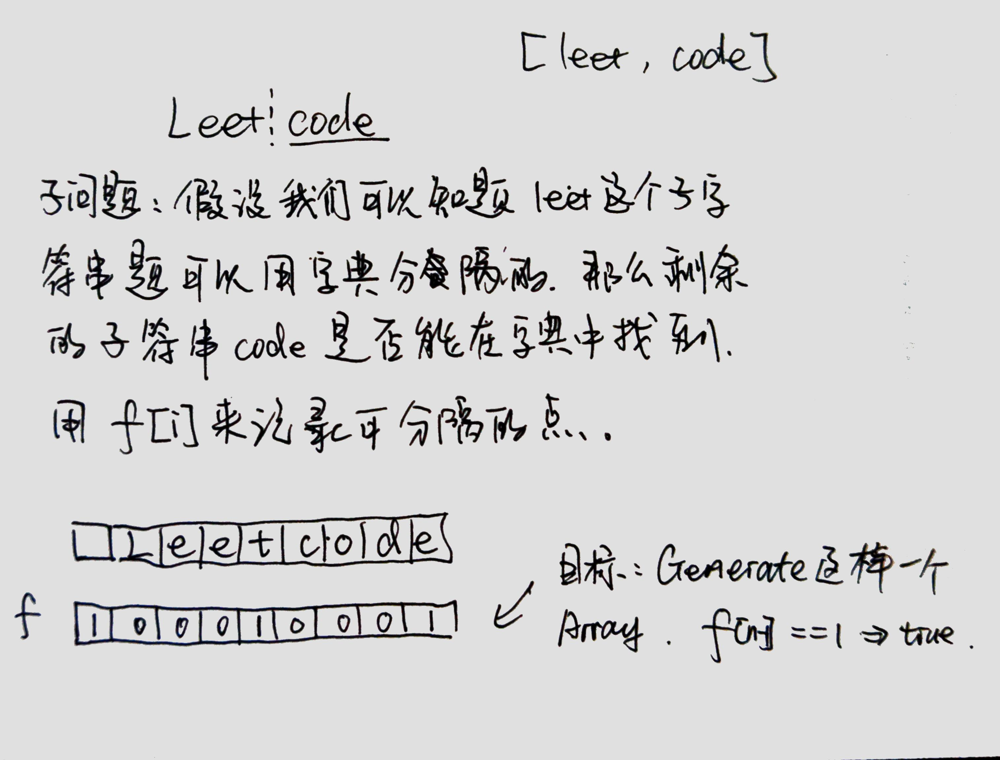

### [139\. Word Break](https://leetcode.com/problems/word-break/)

Difficulty: **Medium**  

Related Topics: [Dynamic Programming](https://leetcode.com/tag/dynamic-programming/)


Given a **non-empty** string _s_ and a dictionary _wordDict_ containing a list of **non-empty** words, determine if _s_ can be segmented into a space-separated sequence of one or more dictionary words.

**Note:**

*   The same word in the dictionary may be reused multiple times in the segmentation.
*   You may assume the dictionary does not contain duplicate words.

**Example 1:**

```
Input: s = "leetcode", wordDict = ["leet", "code"]
Output: true
Explanation: Return true because "leetcode" can be segmented as "leet code".
```

**Example 2:**

```
Input: s = "applepenapple", wordDict = ["apple", "pen"]
Output: true
Explanation: Return true because "applepenapple" can be segmented as "apple pen apple".
             Note that you are allowed to reuse a dictionary word.
```

**Example 3:**

```
Input: s = "catsandog", wordDict = ["cats", "dog", "sand", "and", "cat"]
Output: false
```


#### Solution, DP



```swift
class Solution {
    func wordBreak(_ s: String, _ wordDict: [String]) -> Bool {
        let s = " " + s
        let n = s.count
        var dp = Array(repeating: 0, count: n)
        dp[0] = 1
        
        for i in 1...n - 1 {
            for j in 0..<i {
                if dp[j] == 1 {
                    if wordDict.contains(String(s[s.index(s.startIndex, offsetBy: j + 1)...s.index(s.startIndex, offsetBy: i)])) {
                        dp[i] = 1
                    }
                }
            }
        }
        return dp[dp.count - 1] == 1
    }
}
```

#### Solution, backtracking, to slow

Language: **Swift**

```swift
extension String {
​
    var length: Int {
        return count
    }
​
    subscript (i: Int) -> String {
        return self[i ..< i + 1]
    }
​
    func substring(fromIndex: Int) -> String {
        return self[min(fromIndex, length) ..< length]
    }
​
    func substring(toIndex: Int) -> String {
        return self[0 ..< max(0, toIndex)]
    }
​
    subscript (r: Range<Int>) -> String {
        let range = Range(uncheckedBounds: (lower: max(0, min(length, r.lowerBound)),
                                            upper: min(length, max(0, r.upperBound))))
        let start = index(startIndex, offsetBy: range.lowerBound)
        let end = index(start, offsetBy: range.upperBound - range.lowerBound)
        return String(self[start ..< end])
    }
}
​
class Solution {
    func wordBreak(_ s: String, _ wordDict: [String]) -> Bool {
        var res = false
        backtracking(s, wordDict, 0, [String](), &res)
        return res
    }
    
    
    private func backtracking(_ s: String, _ wordDict: [String], _ i: Int, _ words: [String], _ res: inout Bool) {
        if i == s.count {
            res = true
            return
        }
        
        if words.count != 0 {
            for w in words {
                var j = i, fit = true
                for z in 0...w.count - 1 {
                    if s[j] == w[z] {
                        j += 1
                    } else {
                        fit = false
                    }
                }
                if fit {
                    backtracking(s, wordDict, j, [String](), &res)
                }
            }
        } else {
            // filter the dict
            let start = s[i]
            var words = [String]()
            for w in wordDict {
                if w[0] == start {
                    words.append(w)
                }
            }
            // didn't find anything
            if words.count == 0 {
                return
            }
            // find, continue
            backtracking(s, wordDict, i, words, &res)
        }
    }
}
​
​
```