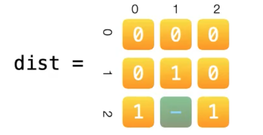

### [542\. 01 Matrix](https://leetcode.com/problems/01-matrix/)

Difficulty: **Medium**  

Related Topics: [Depth-first Search](https://leetcode.com/tag/depth-first-search/), [Breadth-first Search](https://leetcode.com/tag/breadth-first-search/)


Given a matrix consists of 0 and 1, find the distance of the nearest 0 for each cell.

The distance between two adjacent cells is 1.

**Example 1:**

```
Input:
[[0,0,0],
 [0,1,0],
 [0,0,0]]

Output:
[[0,0,0],
 [0,1,0],
 [0,0,0]]
```

**Example 2:**

```
Input:
[[0,0,0],
 [0,1,0],
 [1,1,1]]

Output:
[[0,0,0],
 [0,1,0],
 [1,2,1]]
```

**Note:**

1.  The number of elements of the given matrix will not exceed 10,000.
2.  There are at least one 0 in the given matrix.
3.  The cells are adjacent in only four directions: up, down, left and right.


#### Solution

DFS/BF: 我们很容易想到的就是遍历整个矩阵，当遇到1的时候，我们就向4个方向找0，并更新最短的路径。 这样的做法时间复杂度是O((m*n)^2)，解释矩阵有m行n列，一共有m*n的元素，每个元素的搜索最坏都需要m*n步，所以总共是(m*n)^2。

多源广度优先搜索。




多源广度优先搜索就是在初始化queue的时候，一次性加入多个起始点。


这道题虽然是找1到0的最短距离，但是从0出发找1会更容易。并且我们把多有的0看做一个整体，这样就可以看成一个图。
这个题的过程：
1. 我们想初始化queue和distance矩阵，遍历matrix，如果是0，我们把这个位置坐标加入queue，distance设为0，如果是1，我们把distance设为Int.max
2. 然后我们就从所有的0开始，找1
   从queue中pop出0的位置，因为是BFS，我们每一步只需要看当前位置的上下左右四个方向，如果发现distance[上||下||左||右]的值大于（distance[当前] + 1），说明这是一个需要更新1. 然后我们要把这个被更新的过的左边加入queue。


Language: **Swift**

```swift
class Solution {
    func updateMatrix(_ matrix: [[Int]]) -> [[Int]] {
        let w = matrix[0].count
        let h = matrix.count
        var dist = Array(repeating: Array(repeating: 0, count: w), count: h)
        var queue = [(Int, Int)]() // position of next run
        // init the queue and ans
        for i in 0..<h {
            for j in 0..<w {
                if matrix[i][j] == 1 {
                    dist[i][j] = Int.max
                } else {
                    queue.append((j, i))  // (x, y)
                }
            }
        }
        let dir = [(-1, 0), (1, 0), (0, 1), (0, -1)] // four directions (x, y)
        while !queue.isEmpty {
            let curPos = queue.removeFirst()
            for d in dir {
                let new_x = curPos.0 + d.0, new_y = curPos.1 + d.1
                if new_x < w && new_x >= 0 && new_y < h && new_y >= 0 {
                    if dist[new_y][new_x] > dist[curPos.1][curPos.0] + 1 {
                        dist[new_y][new_x] = dist[curPos.1][curPos.0] + 1
                        queue.append((new_x, new_y))
                    }
                }
            }
        }
        return dist
    }
}
```