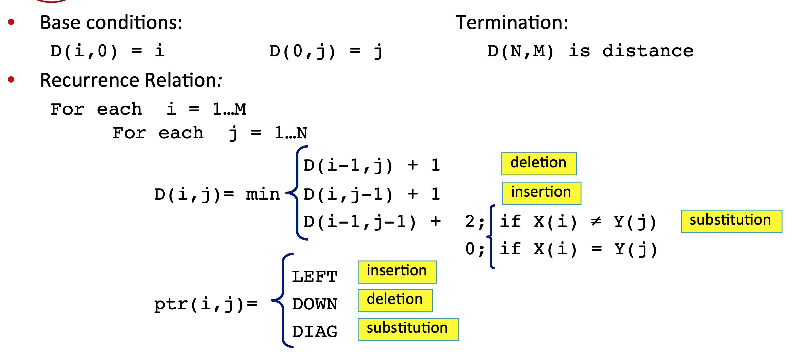

### [72\. Edit Distance](https://leetcode.com/problems/edit-distance/)

Difficulty: **Hard**  

Related Topics: [String](https://leetcode.com/tag/string/), [Dynamic Programming](https://leetcode.com/tag/dynamic-programming/)


Given two words _word1_ and _word2_, find the minimum number of operations required to convert _word1_ to _word2_.

You have the following 3 operations permitted on a word:

1.  Insert a character
2.  Delete a character
3.  Replace a character



**Example 1:**

```
Input: word1 = "horse", word2 = "ros"
Output: 3
Explanation: 
horse -> rorse (replace 'h' with 'r')
rorse -> rose (remove 'r')
rose -> ros (remove 'e')
```

**Example 2:**

```
Input: word1 = "intention", word2 = "execution"
Output: 5
Explanation: 
intention -> inention (remove 't')
inention -> enention (replace 'i' with 'e')
enention -> exention (replace 'n' with 'x')
exention -> exection (replace 'n' with 'c')
exection -> execution (insert 'u')
```


#### Solution

Language: **Swift**

```swift
class Solution {
    func minDistance(_ word1: String, _ word2: String) -> Int {
        let m = word1.count, n = word2.count
        var dp = Array(repeating: Array(repeating: 0, count: m + 1), count: n + 1)
        // init
        for i in 0...m {
            dp[0][i] = i
        }
        for i in 0...n {
            dp[i][0] = i
        }
        
        let word1 = Array(word1)
        let word2 = Array(word2)
        for i in 0...n {
            for j in 0...m {
                if i == 0 || j == 0 { continue }
                let c = (word1[j - 1] == word2[i - 1]) ? 0 : 1
                dp[i][j] = min(dp[i - 1][j - 1] + c, dp[i - 1][j] + 1, dp[i][j - 1] + 1)
            }
        }
        return dp[n][m]
    }
}
​
/*
​
     ""   h   o   r   s   e
""    0   1   2   3   4   5
​
r     1   1   2   2   3   4  
​
o     2   2   1   2   3   4
​
s     3   3   2   2   2   3
​
​
*/
​
​
```