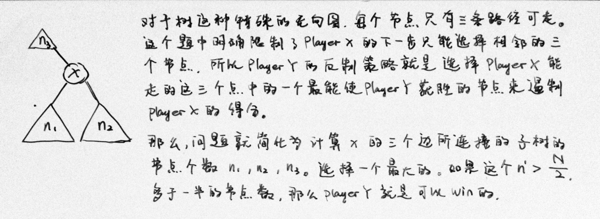
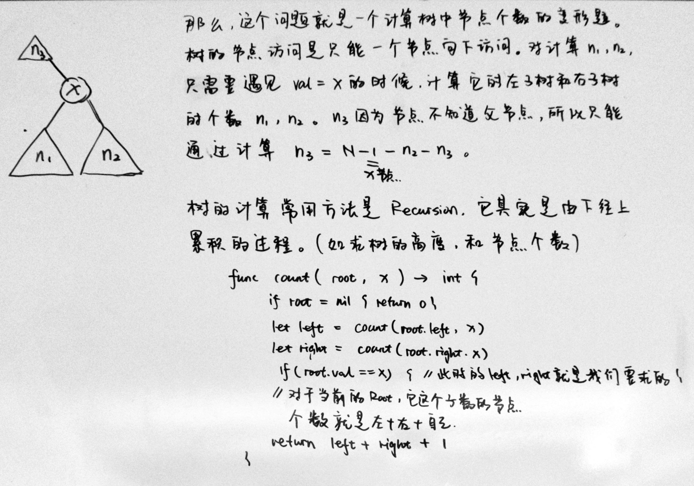

### [1145\. Binary Tree Coloring Game](https://leetcode.com/problems/binary-tree-coloring-game/)

Difficulty: **Medium**


Two players play a turn based game on a binary tree.  We are given the `root` of this binary tree, and the number of nodes `n` in the tree.  `n` is odd, and each node has a distinct value from `1` to `n`.

Initially, the first player names a value `x` with `1 <= x <= n`, and the second player names a value `y` with `1 <= y <= n` and `y != x`.  The first player colors the node with value `x` red, and the second player colors the node with value `y` blue.

Then, the players take turns starting with the first player.  In each turn, that player chooses a node of their color (red if player 1, blue if player 2) and colors an **uncolored** neighbor of the chosen node (either the left child, right child, or parent of the chosen node.)

If (and only if) a player cannot choose such a node in this way, they must pass their turn.  If both players pass their turn, the game ends, and the winner is the player that colored more nodes.

You are the second player.  If it is possible to choose such a `y` to ensure you win the game, return `true`.  If it is not possible, return `false`.

**Example 1:**


```
Input: root = [1,2,3,4,5,6,7,8,9,10,11], n = 11, x = 3
Output: true
Explanation: The second player can choose the node with value 2.
```

**Constraints:**

*   `root` is the root of a binary tree with `n` nodes and distinct node values from `1` to `n`.
*   `n` is odd.
*   `1 <= x <= n <= 100`


#### Solution




Language: **Swift**

```swift
/**
 * Definition for a binary tree node.
 * public class TreeNode {
 *     public var val: Int
 *     public var left: TreeNode?
 *     public var right: TreeNode?
 *     public init() { self.val = 0; self.left = nil; self.right = nil; }
 *     public init(_ val: Int) { self.val = val; self.left = nil; self.right = nil; }
 *     public init(_ val: Int, _ left: TreeNode?, _ right: TreeNode?) {
 *         self.val = val
 *         self.left = left
 *         self.right = right
 *     }
 * }
 */
class Solution {
    func btreeGameWinningMove(_ root: TreeNode?, _ n: Int, _ x: Int) -> Bool {
        var l = 0, r = 0, o = 0
        countNode(root, x, &l, &r)
        o = n - 1 - l - r
        return max(o, max(l, r)) > n/2
    }
    
    @discardableResult
    private func countNode(_ root: TreeNode?, _ x: Int, _ l: inout Int, _ r: inout Int) -> Int {
        if root == nil { return 0 }
        
        let left = countNode(root!.left, x, &l, &r)
        let right = countNode(root!.right, x, &l, &r)
        
        if root!.val == x {
            l = left
            r = right
        }
        return left + right + 1
    }
}
```