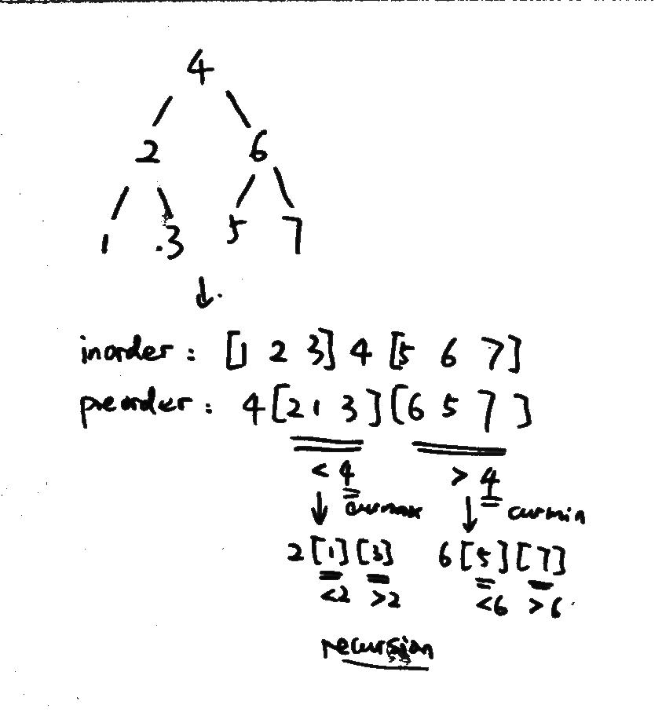

### [449\. Serialize and Deserialize BST](https://leetcode.com/problems/serialize-and-deserialize-bst/)

Difficulty: **Medium**


Serialization is the process of converting a data structure or object into a sequence of bits so that it can be stored in a file or memory buffer, or transmitted across a network connection link to be reconstructed later in the same or another computer environment.

Design an algorithm to serialize and deserialize a **binary search tree**. There is no restriction on how your serialization/deserialization algorithm should work. You just need to ensure that a binary search tree can be serialized to a string and this string can be deserialized to the original tree structure.

**The encoded string should be as compact as possible.**

**Note:** Do not use class member/global/static variables to store states. Your serialize and deserialize algorithms should be stateless.


#### Solution

Language: **Swift**

```swift
/**
 * Definition for a binary tree node.
 * public class TreeNode {
 *     public var val: Int
 *     public var left: TreeNode?
 *     public var right: TreeNode?
 *     public init(_ val: Int) {
 *         self.val = val
 *         self.left = nil
 *         self.right = nil
 *     }
 * }
 */
​
class Codec {
    // Encodes a tree to a single string.
    func serialize(_ root: TreeNode?) -> String {
        // for a BST, the inorder return the sorted array,
        // and the pre-order gives the tree
        var ans = ""
        serialize(root, &ans)
        print(ans)
        return ans 
    }
    
    private func serialize(_ root: TreeNode?, _ ans: inout String) {
        if root == nil { return }
        
        ans += "\(root!.val),"
        
        serialize(root!.left, &ans)
        serialize(root!.right, &ans)
    }
    
    // Decodes your encoded data to tree.
    func deserialize(_ data: String) -> TreeNode? {
        
        var data = data.components(separatedBy:",")
        let d = data.compactMap{ Int($0) } // compactMap remove the nil from the map result
        var pos = 0
        print(d)
        return deserialize(d, &pos, Int.min, Int.max)
    }
    
    private func deserialize(_ data: [Int], _ pos: inout Int, _ curMin: Int, _ curMax: Int) -> TreeNode? {
        if pos >= data.count { return nil }
        let val = data[pos]
        if val > curMax || val < curMin { return nil }
        let node = TreeNode(val)
        pos += 1
        node.left = deserialize(data, &pos, curMin, val)
        node.right = deserialize(data, &pos, val, curMax)
        return node
    }
}
​
/**
 * Your Codec object will be instantiated and called as such:
 * let obj = Codec()
 * val s = obj.serialize(root)
 * let ans = obj.serialize(s)
*/
/**
```