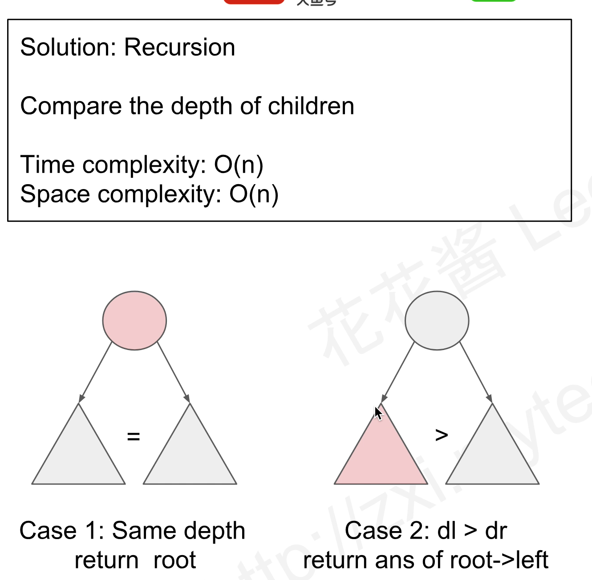

### [865\. Smallest Subtree with all the Deepest Nodes](https://leetcode.com/problems/smallest-subtree-with-all-the-deepest-nodes/)

Difficulty: **Medium**


Given a binary tree rooted at `root`, the _depth_ of each node is the shortest distance to the root.

A node is _deepest_ if it has the largest depth possible among any node in the <u style="display: inline;">entire tree</u>.

The subtree of a node is that node, plus the set of all descendants of that node.

Return the node with the largest depth such that it contains all the deepest nodes in its subtree.

**Example 1:**

```
Input: [3,5,1,6,2,0,8,null,null,7,4]
Output: [2,7,4]
Explanation:

We return the node with value 2, colored in yellow in the diagram.
The nodes colored in blue are the deepest nodes of the tree.
The input "[3, 5, 1, 6, 2, 0, 8, null, null, 7, 4]" is a serialization of the given tree.
The output "[2, 7, 4]" is a serialization of the subtree rooted at the node with value 2.
Both the input and output have TreeNode type.
```


**Note:**

*   The number of nodes in the tree will be between 1 and 500.
*   The values of each node are unique.


#### 思路：
如果一个节点的左右深度相同，说明它的左边和右边都包含有最深的节点，所以这个节点就是结果。
如果左边的深度大于右边的深度，那么拥有所有最深节点的最小树在左边。



#### Solution 1

从上往下，计算根节点的左右子树深度，如果左边大于右边，递归计算左边的子树。

这样的计算比较慢，因为我重复计算了深度，每一次有减少大概一半的节点，所以时间复杂度是O(nlogn)


Language: **Swift**

```swift
/**
 * Definition for a binary tree node.
 * public class TreeNode {
 *     public var val: Int
 *     public var left: TreeNode?
 *     public var right: TreeNode?
 *     public init() { self.val = 0; self.left = nil; self.right = nil; }
 *     public init(_ val: Int) { self.val = val; self.left = nil; self.right = nil; }
 *     public init(_ val: Int, _ left: TreeNode?, _ right: TreeNode?) {
 *         self.val = val
 *         self.left = left
 *         self.right = right
 *     }
 * }
 */
class Solution {
    func subtreeWithAllDeepest(_ root: TreeNode?) -> TreeNode? {
        if root == nil { return root }
        let l = depth(root!.left)
        let r = depth(root!.right)
        if l == r {
            return root
        } else if l < r {
            return subtreeWithAllDeepest(root!.right)
        } else {
            return subtreeWithAllDeepest(root!.left)
        }
    }
    
    private func depth(_ root: TreeNode?) -> Int {
        if root == nil { return -1 }
        return max(height(root!.left), height(root!.right)) + 1
    }
}
```

#### Solution 2

又下往上，在计算深度的过程中，我比较左右两个子树的节点的深度，
如果深度相同，我更新ans = 此时的更节点，
如果某一边的深度更大，更新ans为较深那一边的根节点
O(n)

```swift
class Solution {
    func subtreeWithAllDeepest(_ root: TreeNode?) -> TreeNode? {
        var ans : TreeNode?  // 及时ans是一个class，在传入func的时候也是unmutable的，说明被copy了。 inout对class也是必须的
        depth(root, &ans)
        return ans
    }
    
    private func depth(_ root: TreeNode?, _ ans: inout TreeNode?) -> Int {
        if root == nil { return -1 }
        var ln : TreeNode?
        var rn : TreeNode?
        let l = depth(root!.left, &ln)
        let r = depth(root!.right, &rn)
        
        if l == r { 
            ans = root
        } else {
            ans = l > r ? ln : rn
        }
        
        return max(l, r) + 1
    }
}
```
