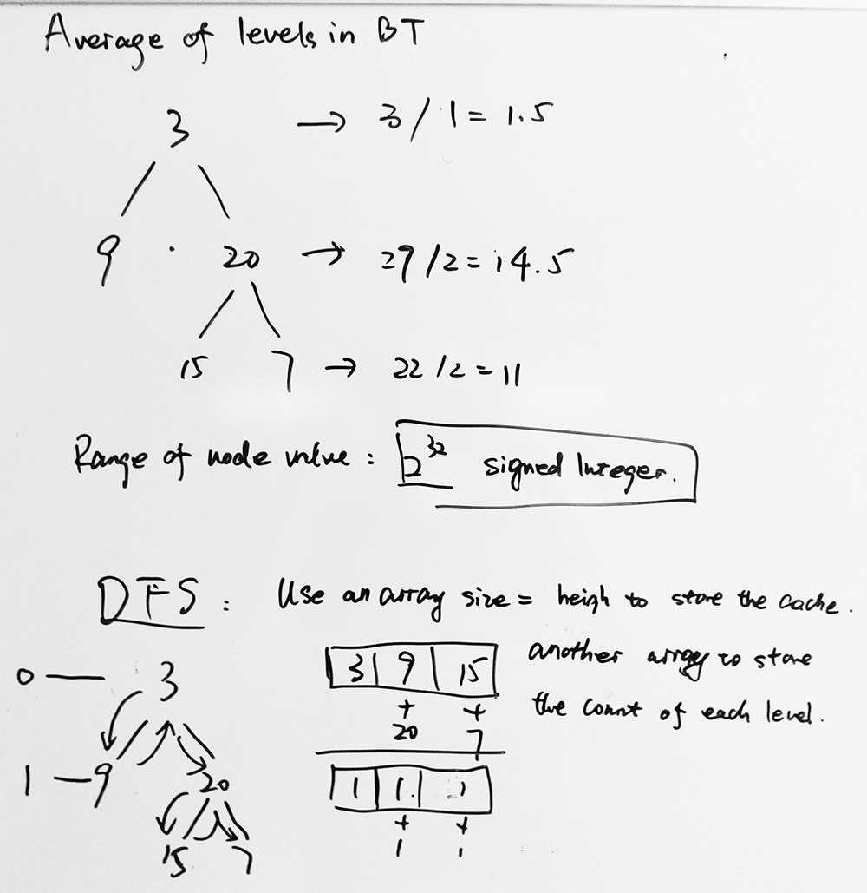

### [637\. Average of Levels in Binary Tree](https://leetcode.com/problems/average-of-levels-in-binary-tree/)

Difficulty: **Easy**

Given a non-empty binary tree, return the average value of the nodes on each level in the form of an array.

**Example 1:**  

```
Input:
    3
   / \
  9  20
    /  \
   15   7
Output: [3, 14.5, 11]
Explanation:
The average value of nodes on level 0 is 3,  on level 1 is 14.5, and on level 2 is 11\. Hence return [3, 14.5, 11].
```

**Note:**  

1.  The range of node's value is in the range of 32-bit signed integer.


#### Solution

思路：很直接就能想到level order traversal。 BFS
但是这道题也能用DFS，而且速度更快，思路是用一个array来记录每一层已经遍历到的所有node的和，用另一个array来记录每一层的node个数。最后求平均值。


Language: **Swift**

```swift
/**
 * Definition for a binary tree node.
 * public class TreeNode {
 *     public var val: Int
 *     public var left: TreeNode?
 *     public var right: TreeNode?
 *     public init() { self.val = 0; self.left = nil; self.right = nil; }
 *     public init(_ val: Int) { self.val = val; self.left = nil; self.right = nil; }
 *     public init(_ val: Int, _ left: TreeNode?, _ right: TreeNode?) {
 *         self.val = val
 *         self.left = left
 *         self.right = right
 *     }
 * }
 */
class Solution {
    func averageOfLevels(_ root: TreeNode?) -> [Double] {
        var res = [Double]()
        if root == nil {
            return res
        }
        
        var queue = [TreeNode]()
        queue.append(root!)
        
        while !queue.isEmpty {
            let n = queue.count
            var sum = 0
            for _ in 0...n-1 {
                let node = queue.removeFirst()
                sum += node.val
                if node.left != nil {
                    queue.append(node.left!)
                }
                if node.right != nil {
                    queue.append(node.right!)
                }
            }
            res.append(Double(sum)/Double(n))
        }
        return res
    }
}
```