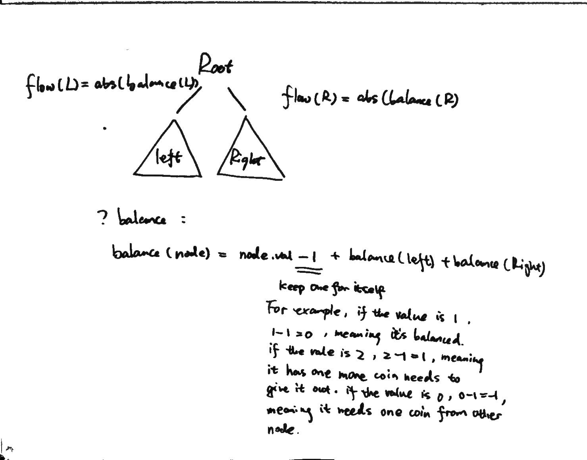
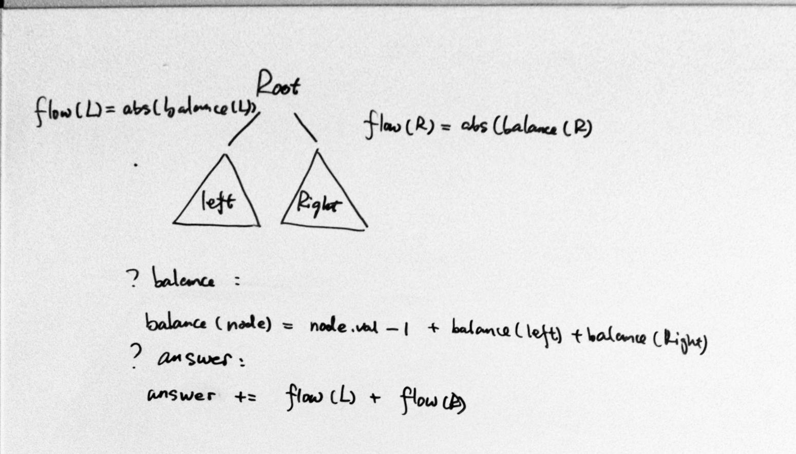
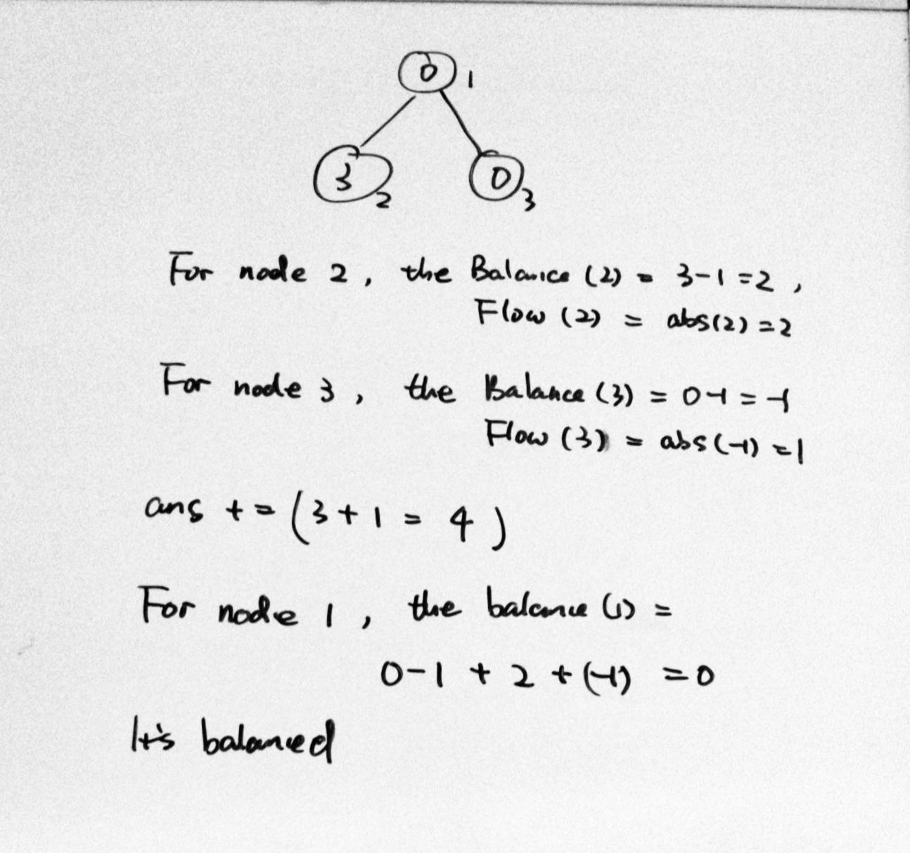
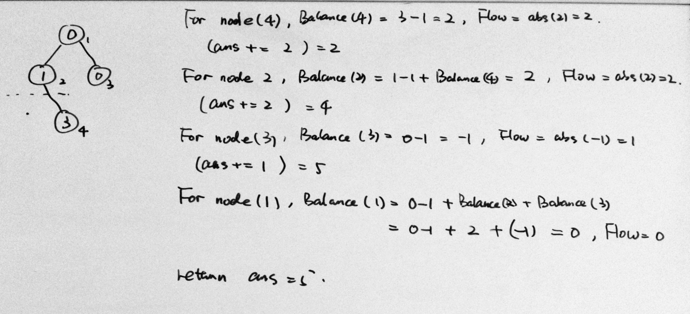

### [979\. Distribute Coins in Binary Tree](https://leetcode.com/problems/distribute-coins-in-binary-tree/)

Difficulty: **Medium**


Given the `root` of a binary tree with `N` nodes, each `node` in the tree has `node.val` coins, and there are `N` coins total.

In one move, we may choose two adjacent nodes and move one coin from one node to another.  (The move may be from parent to child, or from child to parent.)

Return the number of moves required to make every node have exactly one coin.


**Example 1:**

****

```
Input: [3,0,0]
Output: 2
Explanation: From the root of the tree, we move one coin to its left child, and one coin to its right child.
```


**Example 2:**

****

```
Input: [0,3,0]
Output: 3
Explanation: From the left child of the root, we move two coins to the root [taking two moves].  Then, we move one coin from the root of the tree to the right child.
```


**Example 3:**

****

```
Input: [1,0,2]
Output: 2
```


**Example 4:**

****

```
Input: [1,0,0,null,3]
Output: 4
```

**<span style="display: inline;">Note:</span>**

1.  `1<= N <= 100`
2.  `0 <= node.val <= N`


#### Solution
我们在遇到树的问题是，一个思路就是指关心当前的节点，把左边的子树看成left，右边的子树看成right，然后recursion思想，那么左右子树就会一个子问题。
这个问题需要想清楚移动的步数与树中硬币的值的关系。
对于一个节点，我们用balance来定义一个节点左右是否平衡，balance = 0，说明平衡，balance > 0, 说明这个节点的子树总硬币多了，需要移动其他节点，如果balance < 0，说明这个节点的子树缺硬币。
不管是多了还是少了，都需要硬币的流动，那么我们把流动记成Flow，Flow = abs(balance).

那么一个节点的balance应该等于它的硬币数量减一，再加上左边的balance和右边的balance。减一是因为自己要留一个硬币。
blance(root) = root.val - 1 + balance(left) + balance(right) 
对于结果，我们需要累加每一层的flow
ans += flowleft）+ flow(right)





Language: **Swift**

```swift
/**
 * Definition for a binary tree node.
 * public class TreeNode {
 *     public var val: Int
 *     public var left: TreeNode?
 *     public var right: TreeNode?
 *     public init() { self.val = 0; self.left = nil; self.right = nil; }
 *     public init(_ val: Int) { self.val = val; self.left = nil; self.right = nil; }
 *     public init(_ val: Int, _ left: TreeNode?, _ right: TreeNode?) {
 *         self.val = val
 *         self.left = left
 *         self.right = right
 *     }
 * }
 */
class Solution {
    func distributeCoins(_ root: TreeNode?) -> Int {
        var ans = 0
        balance(root, &ans)
        return ans
    }
    
    @discardableResult
    private func balance(_ root: TreeNode?, _ ans: inout Int) -> Int {
        if root == nil { return 0 } // 0 means balanced
        let left = balance(root!.left, &ans)
        let right = balance(root!.right, &ans)
        // update the ans by increment the flows
        ans += abs(left) + abs(right)
        // balance(r) = val - 1 + b(l) + b(r)
        return root!.val - 1 + left + right
    }
}
```