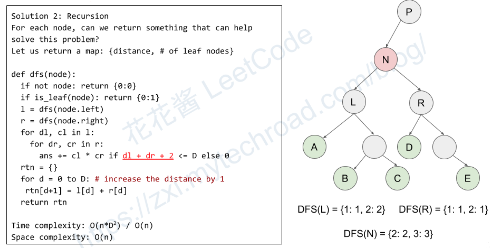

### [1530\. Number of Good Leaf Nodes Pairs](https://leetcode.com/problems/number-of-good-leaf-nodes-pairs/)

Difficulty: **Medium**  

Related Topics: [Tree](https://leetcode.com/tag/tree/), [Depth-first Search](https://leetcode.com/tag/depth-first-search/)


Given the `root` of a binary tree and an integer `distance`. A pair of two different **leaf** nodes of a binary tree is said to be good if the length of **the shortest path** between them is less than or equal to `distance`.

Return _the number of good leaf node pairs_ in the tree.

**Example 1:**


```
Input: root = [1,2,3,null,4], distance = 3
Output: 1
Explanation: The leaf nodes of the tree are 3 and 4 and the length of the shortest path between them is 3\. This is the only good pair.
```

**Example 2:**


```
Input: root = [1,2,3,4,5,6,7], distance = 3
Output: 2
Explanation: The good pairs are [4,5] and [6,7] with shortest path = 2\. The pair [4,6] is not good because the length of ther shortest path between them is 4.
```

**Example 3:**

```
Input: root = [7,1,4,6,null,5,3,null,null,null,null,null,2], distance = 3
Output: 1
Explanation: The only good pair is [2,5].
```

**Example 4:**

```
Input: root = [100], distance = 1
Output: 0
```

**Example 5:**

```
Input: root = [1,1,1], distance = 2
Output: 1
```

**Constraints:**

*   The number of nodes in the `tree` is in the range `[1, 2^10].`
*   Each node's value is between `[1, 100]`.
*   `1 <= distance <= 10`


#### Solution

For each node, compute the # of good leaf pair under itself.
1. count the frequency of leaf node at distance 1, 2, …, d for both left and right child.
2. ans += l[i] * r[j] (i + j <= distance) cartesian product
3. increase the distance by 1 for each leaf node when pop
Time complexity: O(n*D^2)
Space complexity: O(n)



Language: **Swift**

```swift
/**
 * Definition for a binary tree node.
 * public class TreeNode {
 *     public var val: Int
 *     public var left: TreeNode?
 *     public var right: TreeNode?
 *     public init() { self.val = 0; self.left = nil; self.right = nil; }
 *     public init(_ val: Int) { self.val = val; self.left = nil; self.right = nil; }
 *     public init(_ val: Int, _ left: TreeNode?, _ right: TreeNode?) {
 *         self.val = val
 *         self.left = left
 *         self.right = right
 *     }
 * }
 */
class Solution {
    func countPairs(_ root: TreeNode?, _ distance: Int) -> Int {
        var ans = 0
        dfs(root, distance, &ans)
        return ans
    }
    // Return a dict [leaf to root distance : number of the same distance]
    func dfs(_ root: TreeNode?, _ distance: Int, _ ans: inout Int) -> [Int : Int] {
        if root == nil { return [0 : 0] }
        if root!.left == nil && root!.right == nil { return [0 : 1] }
        
        let left = dfs(root!.left, distance, &ans)
        let right = dfs(root!.right, distance, &ans)
        
        // Use cartesian product to update the ans
        for (ld, lc) in left {
            for (rd, rc) in right {
                if (ld + rd + 2) <= distance {
                    ans += lc * rc
                }
            }
        }
        
        // Calculate the return for current root
        var ret = [Int : Int]()
        for (ld, lc) in left {
            ret[ld + 1, default: 0] += lc
        }
        for (rd, rc) in right {
            ret[rd + 1, default: 0] += rc
        }
        return ret
    }
}
```