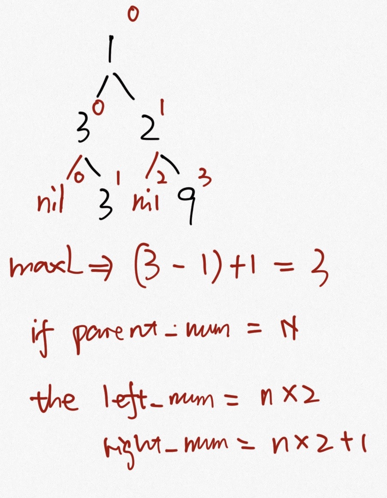

### [662\. Maximum Width of Binary Tree](https://leetcode.com/problems/maximum-width-of-binary-tree/)

Difficulty: **Medium**  

Related Topics: [Tree](https://leetcode.com/tag/tree/)


Given a binary tree, write a function to get the maximum width of the given tree. The maximum width of a tree is the maximum width among all levels.

The width of one level is defined as the length between the end-nodes (the leftmost and right most non-null nodes in the level, where the `null` nodes between the end-nodes are also counted into the length calculation.

It is **guaranteed** that the answer will in the range of 32-bit signed integer.

**Example 1:**

```
Input: 

           1
         /   \
        3     2
       / \     \  
      5   3     9 

Output: 4
Explanation: The maximum width existing in the third level with the length 4 (5,3,null,9).
```

**Example 2:**

```
Input: 

          1
         /  
        3    
       / \       
      5   3     

Output: 2
Explanation: The maximum width existing in the third level with the length 2 (5,3).
```

**Example 3:**

```
Input: 

          1
         / \
        3   2 
       /        
      5      

Output: 2
Explanation: The maximum width existing in the second level with the length 2 (3,2).
```

**Example 4:**

```
Input: 

          1
         / \
        3   2
       /     \  
      5       9 
     /         \
    6           7
Output: 8
Explanation:The maximum width existing in the fourth level with the length 8 (6,null,null,null,null,null,null,7).
```

**Constraints:**

*   The given binary tree will have between `1` and `3000` nodes.


#### Solution

需要注意overflow的问题，如果树的层数来到64，那就会导致overflow。 所以需要做normalize

Language: **Swift**

```swift
/**
 * Definition for a binary tree node.
 * public class TreeNode {
 *     public var val: Int
 *     public var left: TreeNode?
 *     public var right: TreeNode?
 *     public init() { self.val = 0; self.left = nil; self.right = nil; }
 *     public init(_ val: Int) { self.val = val; self.left = nil; self.right = nil; }
 *     public init(_ val: Int, _ left: TreeNode?, _ right: TreeNode?) {
 *         self.val = val
 *         self.left = left
 *         self.right = right
 *     }
 * }
 */
class Solution {
    var dict : [Int : Int] = [1 : 1]
    func widthOfBinaryTree(_ root: TreeNode?) -> Int {
        var res = 0
        widthOfBinaryTree(root, 1, 1, &res)
        return res
    }
    
    private func widthOfBinaryTree(_ root: TreeNode?, _ level: Int, _ num: Int, _ res: inout Int) {
        if root == nil { 
            return
        }
        
        if let left = dict[level] {
            res = max(num - left + 1, res)
        } else {
            dict[level] = num
        }
        
        if root!.left != nil {
            widthOfBinaryTree(root!.left, level + 1, (num - dict[level]!) * 2, &res)
        }
        if root!.right != nil {
            widthOfBinaryTree(root!.right, level + 1, (num - dict[level]!) * 2 + 1, &res)
        }
    }
}
```