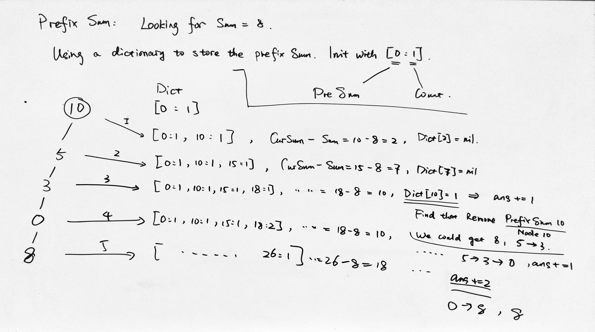

### [437\. Path Sum III](https://leetcode.com/problems/path-sum-iii/)

Difficulty: **Medium**  

Related Topics: [Tree](https://leetcode.com/tag/tree/)


You are given a binary tree in which each node contains an integer value.

Find the number of paths that sum to a given value.

The path does not need to start or end at the root or a leaf, but it must go downwards (traveling only from parent nodes to child nodes).

The tree has no more than 1,000 nodes and the values are in the range -1,000,000 to 1,000,000.

**Example:**

```
root = [10,5,-3,3,2,null,11,3,-2,null,1], sum = 8

      10
     /  \
    5   -3
   / \    \
  3   2   11
 / \   \
3  -2   1

Return 3\. The paths that sum to 8 are:

1\.  5 -> 3
2\.  5 -> 2 -> 1
3\. -3 -> 11
```

#### Solution 1, BF, too slow, worst case is O(n^2)

Language: **Swift**

```swift
/**
 * Definition for a binary tree node.
 * public class TreeNode {
 *     public var val: Int
 *     public var left: TreeNode?
 *     public var right: TreeNode?
 *     public init() { self.val = 0; self.left = nil; self.right = nil; }
 *     public init(_ val: Int) { self.val = val; self.left = nil; self.right = nil; }
 *     public init(_ val: Int, _ left: TreeNode?, _ right: TreeNode?) {
 *         self.val = val
 *         self.left = left
 *         self.right = right
 *     }
 * }
 */

class Solution {
    func pathSum(_ root: TreeNode?, _ sum: Int) -> Int {
        // travel all noot
        var ans = 0
        inorder(root, sum, &ans)
        return ans
    }
    
    func inorder(_ root: TreeNode?, _ target: Int, _ ans: inout Int) {
        if root == nil { return }
        getSum(root, root!.val, target, &ans)
        inorder(root!.left, target, &ans)
        inorder(root!.right, target, &ans)
    }
    
    func getSum(_ root: TreeNode?, _ curSum: Int, _ target: Int, _ ans: inout Int) {
        if root == nil {
            return
        }
        
        if curSum == target {
            ans += 1
        }
        
        if root!.left != nil {
            getSum(root!.left, curSum + root!.left!.val, target, &ans)
        }
        if root!.right != nil {
            getSum(root!.right, curSum + root!.right!.val, target, &ans)
        }
    } 
}
```

#### Solution 2, Using prefix sum to reduce calculation. O(n)



```swift
class Solution {
    func pathSum(_ root: TreeNode?, _ sum: Int) -> Int {
        let prefix_sum_dict = [0 : 1] // prefix sum 0 has 1
        var ans = 0
        pathSum(root, sum, 0, prefix_sum_dict, &ans)
        return ans
    }
    
    private func pathSum(_ root: TreeNode?, _ sum: Int, _ curSum: Int, _ dict: [Int : Int], _ ans: inout Int) {
        if root == nil { return }
        
        var curSum = curSum
        curSum += root!.val
        if let pre_sum_count = dict[curSum - sum] {
            ans += pre_sum_count
        }
        var dict = dict
        dict[curSum, default: 0] += 1
        pathSum(root!.left, sum, curSum, dict, &ans)
        pathSum(root!.right, sum, curSum, dict, &ans)
    }
}
```